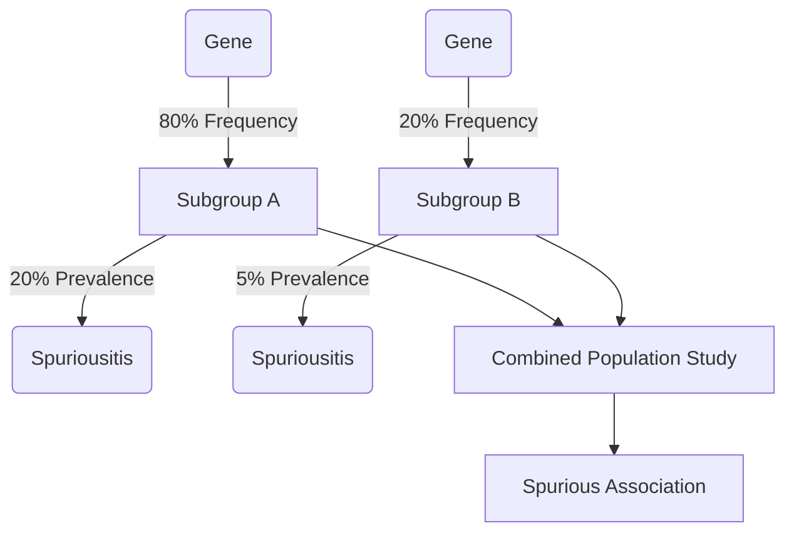

---
tags:
  - StatGen
---
Population stratification due to [[Genetic Drift]] happens when isolated subpopulations, which were once part of a larger, single population, develop different allele frequencies purely by chance. Think of it as a series of random sampling errors over generations.

In short, population stratification is the existence of distinct subgroups within a population that have different allele frequencies. When these groups later mix or are studied together, the differences in allele frequencies can lead to spurious findings in genetic association studies. For example, if a specific disease is more common in one subpopulation and that same subpopulation also happens to have a high frequency of a particular gene variant (due to drift, not because the variant causes the disease), a study could incorrectly conclude that the gene variant is a risk factor for the disease.

